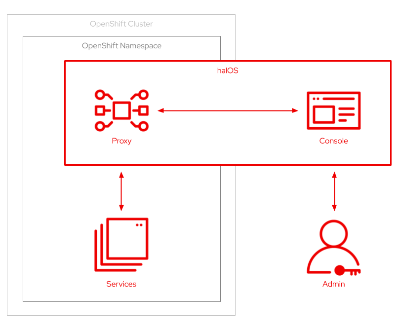

# halOS Distribution

halOS stands for HAL on OpenShift. It is derived from [HAL](https://hal.github.io/) and allows monitoring and inspection of WildFly and other services running on OpenShift. Although the focus is on WildFly, halOS supports the monitoring of arbitrary service. This is achieved through the concept of capabilities and extensions.

## Architecture



halOS consists of two parts:

1. [Proxy](https://github.com/hal/halos-proxy) (back-end)
2. [Console](https://github.com/hal/halos-console) (front-end)

This repository contains scripts to set up halOS on an OpenShift cluster. The easiest way to get started is to use the [OpenShift sandbox](https://developers.redhat.com/developer-sandbox). The sandbox provides you with a private OpenShift environment in a shared, multi-tenant OpenShift cluster that is pre-configured with a set of developer tools.

Finally, you need to install the OpenShift [command line tools](https://docs.openshift.com/container-platform/latest/cli_reference/openshift_cli/getting-started-cli.html) `oc`.

## Setup

The `./setup.sh` script contains everything to set up the OpenShift, halOS and sample services: 

```shell
USAGE:
    setup.sh [FLAGS] all|openshift|halos|services

FLAGS:
    -d, --dev           Apply development settings
    -h, --help          Prints help information
    -v, --version       Prints version information
    --no-color          Uses plain text output

ARGUMENTS:
    all                 Setup everything
    openshift           Setup service account, roles and role binding
    halos               Deploy halOS service and routes
    services            Deploy WildFly and Quarkus demo services
```

You can set up everything in one go, or do it incrementally. The latter is useful if you first want to start halOS and the start some demo services. halOS is deployed from [quay.io/halconsole/halos](https://quay.io/repository/halconsole/halos). The demo services are based on [quay.io/hpehl/wildfly-halos-demo](https://quay.io/repository/hpehl/wildfly-halos-demo), [quay.io/hpehl/quarkus-halos-demo](https://quay.io/repository/hpehl/quarkus-halos-demo) and [quay.io/halconsole/wildfly](https://quay.io/repository/halconsole/wildfly).

## Cleanup

To clean everything up again, use the `./cleanup.sh` script:

```shell
USAGE:
    cleanup.sh [FLAGS] all|halos|services

FLAGS:
    -d, --dev           Apply development settings
    -h, --help          Prints help information
    -v, --version       Prints version information
    --no-color          Uses plain text output

ARGUMENTS:
    all                 Cleanup everything
    openshift           Cleanup service account, roles and role binding
    halos               Undeploy halOS service and routes
    services            Undeploy WildFly and Quarkus demo services
```

## Development

To run halOS in development, follow the related sections for the [proxy](https://github.com/hal/halos-proxy#development) and the [console](https://github.com/hal/halos-console#development).  
